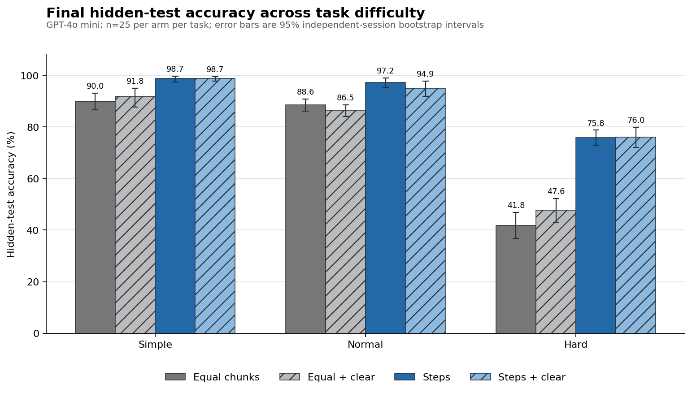

# Three-task long-document evaluation

## Question

Does reorganising a long programming specification into implementation steps help an LLM student compared with mechanically equal text chunks? Does clearing the student's short note change that effect?

## Design

- Model: `gpt-4o-mini-2024-07-18`
- Three reconciliation tasks: simple, normal, and hard
- Four conditions: equal chunks / steps, each with the note retained / cleared
- Clear probability: 0.25 after the first round; only the note is removed
- 25 independent sessions per condition per task; 300 total
- Six reading rounds followed by up to 18 repair rounds
- Primary outcome: final hidden-test accuracy

## Results

| Task | Equal | Equal + clear | Steps | Steps + clear |
|---|---:|---:|---:|---:|
| Simple | 90.0% | 91.8% | 98.7% | 98.7% |
| Normal | 88.6% | 86.5% | 97.2% | 94.9% |
| Hard | 41.8% | 47.6% | 75.8% | 76.0% |

Steps improved accuracy in all six within-task comparisons. The 95% independent-session bootstrap intervals for these six effects were all above zero. Clear itself had no stable effect, and all three clear-by-presentation interaction intervals included zero.

Strict hidden-suite completion counts were 0/0/20/18 on the simple task, 0/0/17/13 on the normal task, and 0/0/0/0 on the hard task, in the same condition order as the table. The hard task hit the 24-round ceiling in every session. Forty-three simple-task sessions stopped after the visible suite passed while hidden accuracy remained below 100%, so round counts are not used as the main comparison.



The result supports an LLM-agent information-organisation mechanism. It is not an estimate of effects on human students or people with ADHD.

## Contents

```text
data/                    compact session data and reproducible analysis
src/run.js               shared experiment runner
src/analyze.js           analysis and bootstrap intervals
src/plot.py              figure generation
src/method.md            experiment rules
src/tasks/{simple,normal,hard}/
  task.md                original specification
  steps.md               human-readable step guide
  presentations.json     exact equal chunks and steps shown to the model
  protocol.json          run settings
  starter.py             initial code
  reference.py           reference solution
  test_visible.py        feedback tests
  test_hidden.py         final tests
  requirements.json      rule-to-test map
```

Raw API transcripts, rate-limit recovery files, pilot runs, and redundant manifests are intentionally excluded.

## Reproduce the analysis

```bash
cd eval/evaluation2/src
node analyze.js
MPLCONFIGDIR=/tmp/cellmate-matplotlib python3 plot.py
```

## Re-run the experiment

Requirements: Node.js, Python, `pytest`, `pytest-json-report`, and an OpenAI API key.

```bash
cd eval/evaluation2/src
npm install
python3 -m pip install pytest pytest-json-report

node run.js --protocol tasks/simple/protocol.json --preflight-only
node run.js --protocol tasks/normal/protocol.json --preflight-only
node run.js --protocol tasks/hard/protocol.json --preflight-only

node run.js --protocol tasks/simple/protocol.json --run-id formal-simple-100 --concurrency 1
node run.js --protocol tasks/normal/protocol.json --run-id formal-normal-100 --concurrency 1
node run.js --protocol tasks/hard/protocol.json --run-id formal-hard-100 --concurrency 1
```

Set `OPENAI_API_KEY` in the environment before running. New raw outputs are written to `eval/evaluation2/runs/`; the included compact results in `data/` are not overwritten.
